<!-- TOP CONTAINER: PROFILE HEADER & ASCII PORTRAIT -->
<table>
  <tr>
    <td width="42%" align="center" valign="top">
       
      
      

        <code>— ascii portrait v1.0 —</code>
      

    </td>
    <td width="58%" valign="top">
       
      

        <code><mark>&nbsp;ALWAYS LEARNING&nbsp;</mark></code>
      

      
<code>> whoami</code>

      <h2>Sidharth P V</h2>
      
<b>Final Year CSE Student</b>

      

 
<b>Location</b> &nbsp;&nbsp;: 

<b>Focus</b> &nbsp;&nbsp;&nbsp;&nbsp;&nbsp;&nbsp;: 

<b>Learning</b> &nbsp;&nbsp;: 

<b>Building</b> &nbsp;&nbsp;: 

<b>Interests</b> &nbsp;: 

<b>Goal</b> &nbsp;&nbsp;&nbsp;&nbsp;&nbsp;&nbsp;&nbsp;: 

      
<code>> life.exe --mission "learn • build • impact"</code>

    </td>
  </tr>
</table>

<!-- MIDDLE CONTAINER: ACTIVITY GRAPH (BLACK & GREEN) -->
 

  
<code>> git log --oneline --graph --all --since=53.weeks</code>

  

 

<!-- BOTTOM CONTAINER: PURE MARKDOWN TABLE FOR STACK & PROJECTS -->
| `> tech stack` | `> featured projects` |
| :--- | :--- |
| **Languages**      **AI / ML**      **Web**      **Tools**     | •
  <b>SightSpeak AI</b> <code>Python</code> <code>OpenCV</code> <code>PyTorch</code> 
  &nbsp;&nbsp;
  • <b>Campus Resource Management System (CRMS)</b> <code>Flask</code> 
  &nbsp;&nbsp;
 

*“ The best way to predict the future is to invent it. ”*  
— Alan Kay

`> thanks for stopping by! have a great day! 👋`

